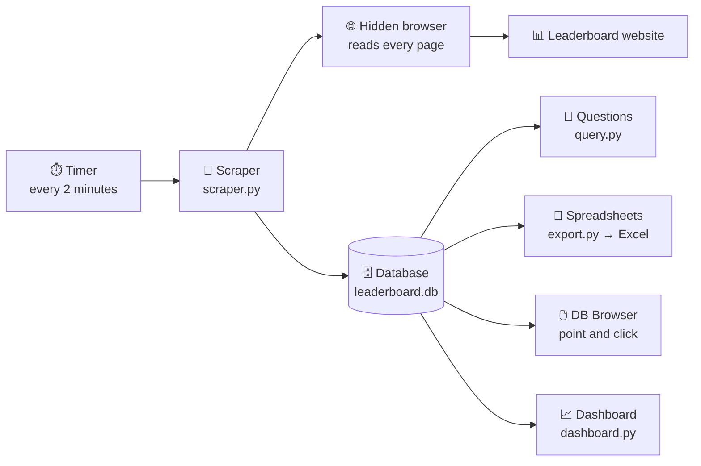

# track-leaderboard

Scrape and track the leaderboard at <https://vfm.bdynamicsstudio.com/leaderboard> on **Windows**.

Every run reads **all pages** of the leaderboard and saves them as one timestamped snapshot in
`data\leaderboard.db`, so you build up a full history of ranks and scores.

## Executive summary (for Jamie)

**What it does:** every 2 minutes, a PC visits the public leaderboard, reads every page of it,
and saves a copy with the time it was taken. Over days and weeks this builds a complete
history, so we can see who is climbing or falling, by how much, and when. The website only
ever shows the leaderboard as it is right now.

**The moving parts:**



| Part | What it is | What it does |
|---|---|---|
| **Timer** | Windows Task Scheduler, or a window left open | Starts the scraper every 2 minutes, and starts it again automatically when the PC is switched on and someone logs in. |
| **Scraper** (`scraper.py`) | The main program | Each run: opens the leaderboard, collects every row from every page, and stores the lot as one dated "snapshot". If a run fails, it records why, so gaps in the data can be explained. |
| **Hidden browser** | Google's Chromium browser, controlled by the scraper | The website blocks simple programs and builds its table with JavaScript, so the scraper uses a real browser in the background. It reads page 1, clicks **Next** until there are no more pages, and hands the rows back. |
| **Database** (`data\leaderboard.db`) | One file on the PC (SQLite) | Keeps every snapshot. One list records each run (when, how many rows, success or failure); the other holds every leaderboard line from every run. Nothing is overwritten, so the history only grows. |
| **Dashboard** (`dashboard.py`) | A web page that runs on the same PC | The quickest way to see what's happening: big movers, the top-5 race, score gains, the most changeable players, who joined or left, and whether the tracker is healthy. Updates itself every 2 minutes. |
| **Getting answers out** | `query.py`, `export.py`, DB Browser | Three ways to dig deeper: ready-made one-line questions (top 10, a player's history, biggest climbers), CSV files for Excel, or a free point-and-click app. |

**How a single run works:**
1. The timer starts the scraper.
2. The scraper opens the hidden browser and loads the leaderboard.
3. It reads the table, clicks **Next**, and repeats until the last page.
4. It saves all the rows as one snapshot with the current time.
5. It closes the browser and waits for the next run. Each run takes a few seconds.

**What to be aware of:**
- **It only collects while the PC is on.** If the PC is off or asleep, those minutes are missed and can't be recovered. For an unbroken record it needs a machine that stays on.
- **The website doesn't welcome automated visitors.** It has a firewall that blocks simple programs. We get past it by using a normal browser, but the site's owners could tighten this or object. Asking them for permission, or for a data feed, would be the most reliable long-term option.
- **Website changes can break it.** If the site's layout changes, the scraper records an error rather than saving bad data, and will need a small fix.
- **It's not been run against the live site yet.** It's been tested against realistic copies of the site; the first live run will confirm it.
- **Storage grows steadily**, roughly tens of MB a day. That's fine for months on a normal PC, and old data can be trimmed if needed.

---

Run every command below in **PowerShell** or **Command Prompt**, one line at a time.

## 1. Install Python and Git (once)

1. Install Python from <https://www.python.org/downloads/>. On the first screen, tick **Add python.exe to PATH**.
2. Install Git from <https://git-scm.com/download/win>. The default options are fine.
3. Open a **new** PowerShell window and check both work:

```
python --version
```

```
git --version
```

## 2. Download the scraper (once)

Go to the folder you want it in, for example `D:\github`:

```
cd D:\github
```

```
git clone https://github.com/leeablett/track-leaderboard
```

```
cd track-leaderboard
```

## 3. Install the libraries (once)

```
python -m pip install -r requirements.txt
```

**Optional:** download Playwright's own copy of Chromium (about 150 MB):

```
python -m playwright install chromium
```

You can skip this. If it isn't installed, or the download fails, the scraper automatically
uses **Microsoft Edge**, which every Windows 10 and 11 PC already has (or Google Chrome).
Run the test in step 4 to check.

> Paste and run commands **one at a time**. If PowerShell shows `>>` at the start of the
> line, it's waiting for more input and hasn't run anything: press **Ctrl+C** and try again.

## 4. Test run

```
python scraper.py --once --browser -v
```

✅ You should see a line like `INFO snapshot 1: 250 rows from 5 page(s)`. Check the page
count matches the website.

To watch the browser while it works, add `--headed`:

```
python scraper.py --once --browser --headed
```

## 5. Run it every 2 minutes

**Option A: in a window.** Runs until you close the window.

```
python scraper.py --loop 120 --browser
```

**Option B: automatically in the background.** Starts whenever you log in.

1. Find where Python is installed:

   ```
   where.exe python
   ```

   It prints something like `C:\Users\YOURNAME\AppData\Local\Programs\Python\Python312\python.exe`.
2. Open **Task Scheduler** and click **Create Basic Task…**
3. **Name:** `Track leaderboard`. **Trigger:** **When I log on**. **Action:** **Start a program**.
4. Fill in:
   - **Program/script:** the path from step 1 with `pythonw.exe` at the end, e.g. `C:\Users\YOURNAME\AppData\Local\Programs\Python\Python312\pythonw.exe`
   - **Add arguments:** `scraper.py --loop 120 --browser`
   - **Start in:** your scraper folder, e.g. `D:\github\track-leaderboard`
5. Tick **Open the Properties dialog…** and click **Finish**. On the **Settings** tab, **untick** *Stop the task if it runs longer than…* and click **OK**.
6. To start it now, right-click the task and choose **Run**.

## 6. Get the data out

Current leaderboard as a spreadsheet (open `latest.csv` in Excel):

```
python export.py latest -o latest.csv
```

Every snapshot ever taken:

```
python export.py history -o history.csv
```

One player's rank and score over time:

```
python export.py player "Some Name" -o player.csv
```

## 7. Look inside the database

All the data is in one file: `data\leaderboard.db`. There are two ways to look at it.
Both are safe to use while the scraper is running.

### Option A: DB Browser for SQLite (point and click)

1. Download and install **DB Browser for SQLite** from <https://sqlitebrowser.org/dl/>. The standard Windows installer is fine.
2. Open it, click **Open Database Read Only…** (in the drop-down next to **Open Database**), and choose `D:\github\track-leaderboard\data\leaderboard.db`.
3. Click the **Browse Data** tab and pick a table or view from the **Table** drop-down:
   - `latest`: the current leaderboard
   - `history`: every entry from every run
   - `snapshots`: one row per run, including failed ones
4. To run your own questions, use the **Execute SQL** tab: paste any query from Option B (without the `python query.py` part and the outer double quotes) and press **F5**.
5. To save what you're looking at, use **File → Export → Table(s) as CSV file…**

Opening it **read-only** means you can't change or lock the data by accident while the scraper is writing to it.

### Option B: one-line queries from PowerShell

`query.py` runs a question against the database and prints the answer as a table. Put the
question in double quotes, and any text inside it in single quotes.

List what's in the database:

```
python query.py --tables
```

Top 10 right now:

```
python query.py "SELECT rank, name, score FROM latest LIMIT 10"
```

Find a player by part of their name:

```
python query.py "SELECT rank, name, score FROM latest WHERE name LIKE '%smith%'"
```

One player's rank and score over time:

```
python query.py "SELECT scraped_at, rank, score FROM history WHERE name = 'Some Name' ORDER BY scraped_at"
```

How many runs have been saved, and when the first and last were:

```
python query.py "SELECT COUNT(*) AS runs, MIN(scraped_at) AS first, MAX(scraped_at) AS last FROM snapshots WHERE status = 'ok'"
```

Recent failed runs and why:

```
python query.py "SELECT scraped_at, error FROM snapshots WHERE status = 'error' ORDER BY id DESC LIMIT 10"
```

Biggest climbers over the last 24 hours:

```
python query.py "SELECT l.name, f.rank AS was, l.rank AS now, f.rank - l.rank AS climbed FROM latest l JOIN history f ON f.name = l.name AND f.snapshot_id = (SELECT MIN(id) FROM snapshots WHERE status = 'ok' AND scraped_at >= strftime('%Y-%m-%dT%H:%M:%S', 'now', '-1 day')) ORDER BY climbed DESC LIMIT 10"
```

See every column the site shows (the `rank`, `name` and `score` columns are picked out; the rest are kept in `data`):

```
python query.py "SELECT j.key AS column_name, j.value AS example FROM latest, json_each(latest.data) AS j WHERE latest.position = 1"
```

Use one of those extra columns, for example `country`. Swap in a name from the list above:

```
python query.py "SELECT rank, name, json_extract(data, '$.country') AS country FROM latest"
```

Save any result to a CSV file for Excel by adding `-o` and a file name:

```
python query.py "SELECT * FROM history WHERE name = 'Some Name'" -o some-name.csv
```

Times in `scraped_at` are UTC (UK winter time; one hour behind UK summer time).

## 8. Dashboard

A live page with the main analysis, viewed in your web browser at <http://localhost:8050>.

The dashboard is a **separate process** from the scraper. Each starts and stops on its own:
stopping the dashboard never stops the data collection, and the dashboard can be opened or
closed at any time. Run all commands from your scraper folder (e.g. `cd D:\github\track-leaderboard`).

### Quick reference

| To… | Run |
|---|---|
| Start it in the background (no window) | `Start-Process pythonw dashboard.py` |
| Check whether it's running | `python dashboard.py --status` |
| Open it in your browser | `python dashboard.py` (if it's already running, this just opens the page) |
| Stop it | `python dashboard.py --stop` |
| Try it with made-up data | `python dashboard.py --demo` |

### Option A: start it in its own window

Start:

```
python dashboard.py
```

Your browser opens the dashboard. Keep this PowerShell window open while you use it.

Stop: click in that window and press **Ctrl+C**, or just close the window.

### Option B: start it in the background (recommended)

This runs the dashboard with no window, so you can close PowerShell and it keeps going.

Start (PowerShell):

```
Start-Process pythonw dashboard.py
```

In Command Prompt use this instead:

```
start "" pythonw dashboard.py
```

Your browser opens the dashboard after a second or two. Close the browser tab whenever you
like; the dashboard keeps running in the background until you stop it or log off.

Check it's running:

```
python dashboard.py --status
```

✅ You should see `Dashboard is running at http://localhost:8050 (process 1234, ...)`.

Open it again later:

```
python dashboard.py
```

Stop it:

```
python dashboard.py --stop
```

✅ You should see `Dashboard stopped.` Running `--status` again then says `Dashboard is not running on port 8050.`

### Option C: start it automatically when you log on

1. Open **Task Scheduler** and click **Create Basic Task…**
2. **Name:** `Leaderboard dashboard`. **Trigger:** **When I log on**. **Action:** **Start a program**.
3. Fill in (find the Python folder with `where.exe python`, as in step 5):
   - **Program/script:** your `pythonw.exe`, e.g. `C:\Users\YOURNAME\AppData\Local\Programs\Python\Python312\pythonw.exe`
   - **Add arguments:** `dashboard.py --no-browser`
   - **Start in:** your scraper folder, e.g. `D:\github\track-leaderboard`
4. Tick **Open the Properties dialog…**, click **Finish**, then on the **Settings** tab **untick** *Stop the task if it runs longer than…* and click **OK**.

Open the dashboard any time with `python dashboard.py` or by browsing to <http://localhost:8050>.
Stop it with `python dashboard.py --stop`. It starts again at your next log on, or right-click
the task and choose **Run**.

### Running the scraper and dashboard together

| Process | Start | Stop |
|---|---|---|
| Scraper (collects data) | `python scraper.py --loop 120 --browser`, or the Task Scheduler task from step 5 | **Ctrl+C** in its window, or right-click its task → **End** |
| Dashboard (shows data) | `Start-Process pythonw dashboard.py`, or the Task Scheduler task above | `python dashboard.py --stop` |

### Demo data

Want to see it before you have real data? This fills `data\demo.db` with three days of made-up history:

```
python dashboard.py --demo
```

If a dashboard is already running, stop it first (`python dashboard.py --stop`), otherwise
this just opens the one already running. To go back to real data, stop the demo and start
it normally.

### Using the dashboard

Use the **Compare over** buttons at the top (last hour, 6 hours, 24 hours, 7 days, all time)
to change the period every widget looks at.

| Widget | What it shows |
|---|---|
| **At a glance** | Players on the board, when the last update was (with a ✓ Up to date / ! Delayed / ✕ Stopped light), how many runs worked in the last 24 hours, and how much history has been collected. |
| **Big movers** | The 8 biggest climbers and 8 biggest fallers over the period, with their rank then → now. |
| **Biggest score gains** | Who added the most points over the period. A good guide to who's most active. |
| **Top 5 race** | A chart of how today's top 5 have swapped places over the period. Hover for exact ranks at any time, or click **Show as table**. |
| **Most changeable** | Players in the top 100 whose rank swung the most, with their best, worst and a mini trend line. |
| **New and gone** | Players who joined the leaderboard or dropped off it during the period. |

Hover over (or tab to) any bar or chart for exact numbers. The page follows your Windows
light/dark setting.

To let others on your network open it (they use your PC's address, which is shown when it starts):

```
python dashboard.py --share
```

Windows may ask whether to allow Python through the firewall. Allow it on **private** networks only.

If port 8050 is used by another program, pick another port. Use the same `--port` with `--status` and `--stop`:

```
python dashboard.py --port 8051
```

### Dashboard problems

| What you see | What to do |
|---|---|
| `Can't start on port 8050` | Something else is using that port. Start with `--port 8051` (and use `--port 8051` with `--status` / `--stop`). |
| Browser says *This site can't be reached* | The dashboard isn't running. Start it again. `python dashboard.py --status` confirms. |
| Page shows *No leaderboard data yet* | The scraper hasn't saved a successful run yet. Start the scraper (step 5). |
| Page shows the demo players | You started it with `--demo`. Run `python dashboard.py --stop`, then start it without `--demo`. |
| `pythonw` is not recognized | Use `pyw` instead: `Start-Process pyw dashboard.py`. |

## Checking the scraper still works (for developers)

The scraper is tested against mock leaderboards that use the common pagination styles
("Next »" buttons, numbered pages, icon-only arrows, "Load more", slow-loading pages, 250 pages):

```
python tests/run_pagination_tests.py
```

✅ You should see `PASS` on every line and `All passed.` at the end.

## Updating the scraper

Do this whenever there's a new version. Your collected data (`data\leaderboard.db`) is
never touched by an update.

1. If the scraper or dashboard is running, stop it first (press **Ctrl+C** in its window,
   or run `python dashboard.py --stop` for a background dashboard).
2. Go to your scraper folder (use your own path):

   ```
   cd D:\github\track-leaderboard
   ```

3. Download the latest version:

   ```
   git pull
   ```

   ✅ You should see a list of changed files, or `Already up to date.`
4. Install any new libraries:

   ```
   python -m pip install -r requirements.txt
   ```

5. Check it still works:

   ```
   python scraper.py --once --browser -v
   ```

6. Start the scraper and dashboard again as usual.

### If the update fails

| What you see | What to do |
|---|---|
| `fatal: not a git repository` | The folder was downloaded as a ZIP, not with `git clone`, so it can't update itself. Download it again with git (step 2 at the top), then copy your old `data` folder into the new folder to keep your history. |
| `Your local changes ... would be overwritten by merge` | A file in the folder was edited. Put your edits aside with `git stash`, then run `git pull` again. |
| `Please commit your changes or stash them` | Same as above: `git stash`, then `git pull`. |
| `'git' is not recognized` | Install Git (step 1 at the top), then open a new PowerShell window. |

## Options

| Option | What it does |
|---|---|
| `--once` | Scrape once and stop |
| `--loop 120` | Scrape every 120 seconds until stopped |
| `--browser` | Use a real browser (needed for this site) |
| `--headed` | Show the browser window (with `--browser`) |
| `--browser-channel msedge` | Which browser to use: `auto` (default), `chromium`, `msedge` or `chrome` |
| `--page-delay 0.5` | Seconds to wait between pages |
| `--max-pages 1000` | Safety limit on pages per run (a warning is logged if it's reached) |
| `--diagnose` | Save every page (and a screenshot) to `data\debug` and log how each next page was found |
| `--db PATH` | Use a different database file |
| `-v` | Show detailed logs |

## Problems

| What you see | What to do |
|---|---|
| `'python' is not recognized` | Python isn't on PATH. Re-run the Python installer, choose **Modify**, tick **Add Python to environment variables**, then open a new window. |
| Typing `python` opens the Microsoft Store | Use `py` in place of `python`, e.g. `py scraper.py --once --browser`. |
| `No module named 'bs4'` or `'playwright'` | Run `python -m pip install -r requirements.txt` again. |
| `Failed to install browsers` / `Failed to download Chrome for Testing` | Skip that step; the scraper uses Microsoft Edge instead. Check with `python scraper.py --once --browser -v`; the log should say `using browser: msedge`. |
| `couldn't start a browser` | No usable browser was found. Install or update Microsoft Edge (or Google Chrome), or retry `python -m playwright install chromium` on a different network. |
| You want a particular browser | Add `--browser-channel msedge` (Edge), `--browser-channel chrome` (Google Chrome) or `--browser-channel chromium` (Playwright's own). |
| `>>` appears at the start of the line in PowerShell | PowerShell is waiting for more input; nothing has run. Press **Ctrl+C**, then paste one command at a time. |
| `HTTP 406: the site's firewall blocked the request` | Add `--browser` to the command. |
| `the site's firewall blocked the browser too` | Try adding `--headed`. If it's still blocked, the site doesn't allow automated access; contact the site owner. |
| `no leaderboard <table> found` | The page was saved to `data\debug\page_1.html`. Send that file over so the scraper can be adjusted. |
| Not all pages are read | Every run logs a line like `read 12 page(s), 300 rows; stopped because the Next label is disabled (last page)`. Check the page count matches the website. If it doesn't, run `python scraper.py --once --browser --diagnose`, then send the log and the files in `data\debug` (a screenshot and HTML of each page). |
| `WARNING the site says there are N pages but only M were read` | The scraper saw the site's own page count ("Page 1 of 37" or "1–25 of 912") and read fewer. Run with `--diagnose` as above and send the results. |
| `WARNING stopped at --max-pages` | The leaderboard has more pages than the safety limit. Add e.g. `--max-pages 5000`. |

## How the data is stored

One SQLite file, `data\leaderboard.db`. See [Look inside the database](#7-look-inside-the-database) for how to open it.

Two handy **views** are built on top of the tables: `latest` (the most recent successful run) and `history` (every successful run). `query.py` creates them the first time you run it.

**`snapshots`**: one row per scrape run

| column | meaning |
|---|---|
| `id` | snapshot id |
| `scraped_at` | time of the run (UTC) |
| `pages`, `row_count` | how much was scraped |
| `status`, `error` | `ok` or `error` (failed runs are recorded too) |
| `content_hash` | the same as the previous snapshot means nothing changed |

**`entries`**: one row per leaderboard line per snapshot

| column | meaning |
|---|---|
| `snapshot_id` | which run it came from |
| `page`, `position` | page number and overall order on the site |
| `rank`, `name`, `score` | the main fields |
| `data` | every column exactly as shown on the site |

At one run every 2 minutes, the database grows by about 720 snapshots a day (tens of MB).

Using Mac or Linux? See [SETUP.md](SETUP.md).
