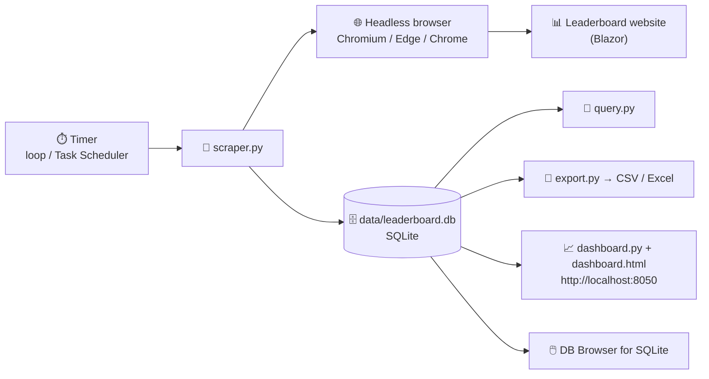
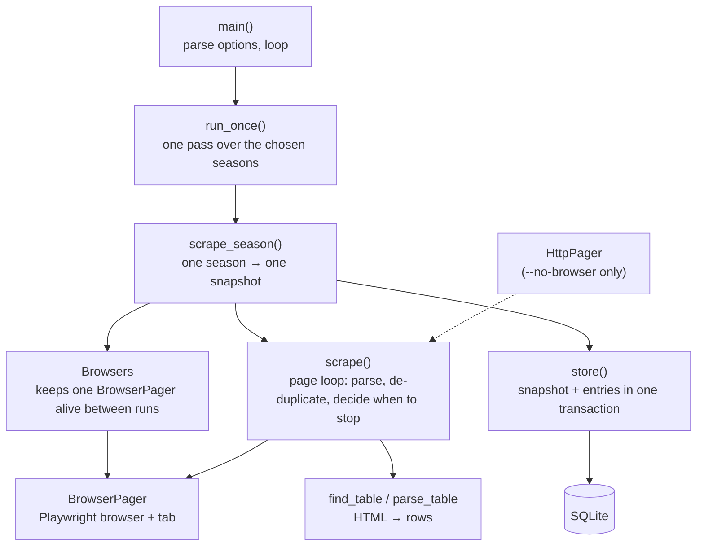
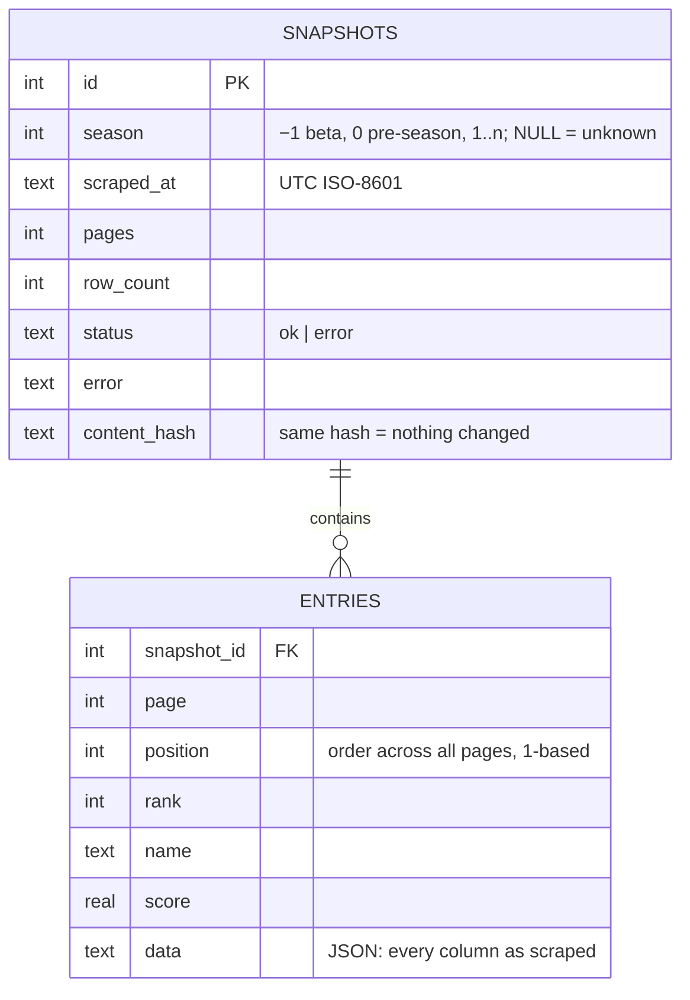

# track-leaderboard: solution document

A reference for how the leaderboard tracker works, why it's built the way it is, and how to run,
change and troubleshoot it. For day-to-day instructions see the [README](../README.md); this
document is the "why and how" behind it.

| | |
|---|---|
| **Repository** | <https://github.com/leeablett/track-leaderboard> |
| **Tracks** | <https://vfm.bdynamicsstudio.com/leaderboard?season=4> (all pages, every 2 minutes) |
| **Runs on** | A Windows PC (Mac/Linux also supported, see [SETUP.md](../SETUP.md)) |
| **Language** | Python 3.9+ with Playwright, BeautifulSoup, requests; SQLite; plain HTML/JS dashboard |
| **Status** | In use against the live site; 19 pagination, 24 season and 7 profile test checks passing |

## Contents

1. [Purpose and scope](#1-purpose-and-scope)
2. [Solution at a glance](#2-solution-at-a-glance)
3. [Architecture](#3-architecture)
4. [How a scrape works, step by step](#4-how-a-scrape-works-step-by-step)
5. [Scraper design in detail](#5-scraper-design-in-detail)
6. [Data model](#6-data-model)
7. [Seasons](#7-seasons)
8. [Getting data out: query, export, dashboard](#8-getting-data-out-query-export-dashboard)
9. [Operations](#9-operations)
10. [Configuration reference](#10-configuration-reference)
11. [Logs and diagnostics](#11-logs-and-diagnostics)
12. [Testing](#12-testing)
13. [The target site: what we know about it](#13-the-target-site-what-we-know-about-it)
14. [Design decisions and project history](#14-design-decisions-and-project-history)
15. [Limitations, risks and future work](#15-limitations-risks-and-future-work)
16. [Glossary](#16-glossary)

---

## 1. Purpose and scope

**Problem.** The leaderboard website only ever shows the standings *as they are right now*. There's
no history: you can't see who climbed or fell, by how much, or when.

**Solution.** A small program on a PC visits the leaderboard every 2 minutes, reads **every page**,
and stores a timestamped copy (a *snapshot*) labelled with its **season**. Over time this builds a
complete history that can be queried, exported to Excel, or explored on a live dashboard.

**In scope**

- Scraping all pages of one or more seasons' leaderboards on a schedule
- Storing every snapshot permanently in a local database
- Tools to answer questions (one-line queries), export CSVs, and a local dashboard
- Running reliably on ordinary, including older, Windows PCs

**Out of scope**

- Hosting in the cloud or a shared server (it runs on a PC, see [§15](#15-limitations-risks-and-future-work))
- Logging in to the site or anything not shown publicly on the leaderboard
- Real-time alerts/notifications

---

## 2. Solution at a glance



| Part | File(s) | Role |
|---|---|---|
| Scraper | `scraper.py` | Opens the leaderboard in a real browser, pages through it, parses rows, stores a snapshot per season. Also owns the database schema, migrations and views. |
| Dashboard | `dashboard.py`, `dashboard.html` | Tiny local web server (Python standard library) + single-page UI with six analysis widgets. Read-only on the database. |
| Query tool | `query.py` | Runs one-line SQL against the database and prints a table or writes CSV. |
| Export tool | `export.py` | Ready-made CSV exports: latest leaderboard, full history, one player. |
| Tests | `tests/` | Mock leaderboard sites and three test runners (pagination, seasons, browser profile). |
| Deployment examples | `deploy/` | cron and systemd examples for Linux. Windows uses Task Scheduler (README). |
| Docs | `README.md`, `SETUP.md`, `docs/SOLUTION.md` | User guide (Windows), Mac/Linux setup, this document. |

Dependencies (`requirements.txt`): `requests`, `beautifulsoup4`, `playwright`. Everything else is
the Python standard library (`sqlite3`, `http.server`, `argparse`, …). No server, database engine or
web framework to install.

---

## 3. Architecture

### 3.1 Processes

Two independent processes share one database file:

| Process | Started with | Writes DB? | Lifetime |
|---|---|---|---|
| **Scraper** | `python scraper.py` (or Task Scheduler) | Yes | Runs continuously, one scrape every 2 minutes |
| **Dashboard** | `python dashboard.py` / `Start-Process pythonw dashboard.py` | No (opens it read-only) | Runs while you want it; `--stop` to end |

They never talk to each other directly. SQLite in **WAL mode** lets the dashboard, `query.py`,
`export.py` and DB Browser read while the scraper writes.

### 3.2 Inside the scraper



| Component | Responsibility |
|---|---|
| `main()` | Command-line options, logging, the 2-minute loop, clean Ctrl+C. |
| `run_once()` | Works out the seasons (`--season` or the one in `--url`) and scrapes each. |
| `scrape_season()` | Gets a browser, runs `scrape()`, stores a snapshot (or an error snapshot). |
| `Browsers` | Keeps one browser open between loop runs; replaces it after an error and every 30 runs. |
| `BrowserPager` | The browser: launch (with channel fallback and saved profile), open a page, find and click "next", wait for changes, retry, screenshots. |
| `HttpPager` | Plain-HTTP alternative (no JavaScript). The live site needs the browser; kept for other sites/tests. |
| `scrape()` | The page loop: parse each page, keep only new rows, stop at the end, log progress and timings. |
| `find_table()` / `parse_table()` | Pick the leaderboard table and turn rows into records with named columns. |
| `connect()` / `migrate()` / `store()` | Schema, in-place upgrades of older databases, writing snapshots. |

---

## 4. How a scrape works, step by step

```mermaid
sequenceDiagram
    participant L as Loop (every 120 s)
    participant S as scraper
    participant B as Browser
    participant W as Website
    participant D as Database
    L->>S: run_once()
    S->>B: reuse open browser (or start one)
    S->>B: new tab; clear cookies + site storage (keep cache)
    B->>W: GET /leaderboard?season=4
    W-->>B: page + Blazor app (cached code reused)
    S->>B: wait for table, then until it stops changing (300 ms)
    S->>S: parse page 1 → rows; log "page 1: 100 rows in 1.1 s"
    loop each further page
        S->>B: find the ">>" control in the pager; click
        B->>W: (Blazor updates the table in place)
        S->>B: wait until the table changes, then settles
        S->>S: parse → keep only rows not already read
    end
    S->>B: click ">>" on the last page → nothing changes (end check)
    S->>D: store snapshot (season, time, pages, rows) + entries
    S->>L: log "took …", "snapshot N: … rows from … page(s)"
```

1. **Pick the seasons.** Default: season 4 (from the address). `--season 4,5` or `-1-3` gives several; each becomes its own snapshot.
2. **Get a browser.** In the loop, the browser from the previous run is reused (fresh tab, cookies and site storage cleared, download cache kept).
3. **Open page 1** and wait until the table exists and has looked the same for 300 ms.
4. **Parse** the table into rows; record which rows have been seen.
5. **Find "next"** using the rules in [§5.3](#53-finding-the-next-page-control), click it, wait for the table to change.
6. **Repeat** until the end is detected ([§5.5](#55-deciding-its-the-last-page)).
7. **Store** the snapshot and all its rows in one transaction; failures are stored too, as `status = 'error'`.
8. **Log** per-page progress, a stop reason, a timing summary and the snapshot line.

---

## 5. Scraper design in detail

### 5.1 Why a real browser

The site rejects plain HTTP clients: its firewall (**Mod_Security**) answers `406 Not Acceptable`, and
the leaderboard itself is drawn by JavaScript (**Blazor**), so the raw HTML has no rows. The scraper
therefore drives a real, headless browser with Playwright. It's an ordinary browser: no disguises,
CAPTCHA solving or IP rotation.

**Browser choice** (`--browser-channel auto`, the default), first that starts wins:

1. Playwright's own Chromium (if `python -m playwright install chromium` was run)
2. **Microsoft Edge**: present on every Windows 10/11 PC, so the Chromium download is optional
3. Google Chrome

### 5.2 Saved browser profile (download cache)

Idea contributed by JT. The browser runs with a persistent profile in
`data/browser-profile/<browser>` so its **HTTP cache survives restarts**: the site's code isn't
downloaded again every time a browser starts.

| Kept between runs | Cleared at the start of every run |
|---|---|
| HTTP download cache | Cookies (`context.clear_cookies()`) |
| | Site storage: local storage, IndexedDB, WebSQL, service workers, file systems (CDP `Storage.clearDataForOrigin`) |
| | The tab: each run opens a new one (clears session storage) |

So every run is a "first visit" that starts on page 1, which matters if a site remembers your last page.
If the profile is locked (another scraper running) or unusable, the run falls back to a throwaway
browser and logs a warning. `--no-profile` disables it.

**Images** are switched off with the browser setting `--blink-settings=imagesEnabled=false`.
Intercepting requests (Playwright `route`) was tried first, but it silently **disables the HTTP cache**,
so it was replaced; see [§14](#14-design-decisions-and-project-history).

### 5.3 Finding the next-page control

The same rules exist in two forms: JavaScript in the browser (`NEXT_JS`) and Python for plain-HTTP
mode (`next_page_url`). Candidates are links, buttons, form inputs, `[role=button]`, `[onclick]`,
`[tabindex]`, **plus any element whose own text is an arrow / "Next" / "Load more"** (sites often make
a `<div>`/`<span>` clickable with script). Controls inside tables count (this site's pager is a table row).

Rules, in order of preference:

| # | Rule | Examples |
|---|---|---|
| 1 | `rel="next"` | `<a rel="next">` |
| 2 | Next-style label (text, `aria-label`, `title`, or an input's `value`) | `Next`, `Next »`, `Next page ›`, `Go to next page`, `>>`, `»`, `›`, `→` |
| 3 | `next` in the class or id | `pagination-next`, `page-next` |
| 4 | Icon-only arrow next to page numbers | `<i class="fa fa-angle-double-right">` |
| 5 | The next page **number**, only inside the pagination bar | `1 2 [3] 4` |
| 6 | Load more | `Load more`, `Show more` |

**Which match wins.** Controls *in the pagination bar* beat others, then controls below the table,
then page order. The pagination bar is a container (up to 4 levels up, never one that also holds the
table) that has a pager-like class (`pagina`, `pager`, `page-nav`, `page-select`, `paging`), at least two
page-number buttons, or short text like `Page 2`. If the bar has a match, *only* the bar counts. That's
how a "›" round switcher elsewhere on the page is ignored.

**Disabled** (`disabled`, `aria-disabled="true"`, or a `disabled` class on it or its parent) in the
bar means **last page**.

**Override:** `--next ">>"` (text; `>>` also matches `»`) or `--next "<CSS selector>"`.

### 5.4 Waiting strategy

| Situation | Wait | Why |
|---|---|---|
| After loading or clicking | Table exists (≤20 s), then table unchanged for **300 ms** (checked every 50 ms, ≤3 s) | "Network idle" never happens on this site (Blazor's live connection, sometimes falling back to constant polling), which cost 3 s per page |
| After clicking ">>" | Until the table's fingerprint changes (row count + first + last row), or a full page reload is detected | Works for in-place updates (Blazor), full reloads (form posts), and growing tables (Load more) |
| How long to wait for that change | **Adaptive:** 4× the slowest page seen so far (min 4 s, max 10 s); 10 s until a page change has been seen | Quick on a fast site, generous on a slow PC/site |
| Retries (see 5.5) | 2× slowest (min 2 s, max 10 s) each | Shorter end check |
| A click that can't land (control redrawn) | Give up after 5 s and check whether the page moved anyway | Avoids a 30 s failure when a slow page finishes loading mid-click |

A **full page reload** is spotted by marking the document (`data-lb-old`) before clicking: the new
document doesn't carry the mark.

### 5.5 Deciding it's the last page

1. The pagination bar's next control is **disabled** → last page. *Or*
2. No next control is found after having clicked one before → last page. *Or*
3. A page shows **only rows already read**. Before concluding, the scraper waits a little longer, then
   clicks next **once more**. If still nothing new:
   - same rows as the **previous** page → `Next no longer changes the page, so page N is the last`
     (**normal for this site**: its `>>` stays clickable on the last page)
   - same rows as an **earlier** page (e.g. page 1) → paging went wrong; the log lists the
     `pagination controls on the page` to diagnose it
4. Safety limit `--max-pages` (default 1000) with a warning.

If the site shows its own totals ("Page 1 of 37", "1–25 of 912") and fewer were read, a warning is logged.

### 5.6 Parsing the table

- **Which table:** the one with headings and the most rows; on later pages, the one whose headings
  match page 1's.
- **Own rows only:** rows of nested tables are ignored (each player cell on this site contains a
  one-row table).
- **Headings:** a `<thead>`, a row of `<th>`, or (this site) the first row of plain-text `<td>`s followed
  by rows with numbers. Pager rows (`<<  Page 2  >>`) are skipped and never stored as players.
- **Rank and name:** a cell whose inner table (or text) starts with `#<n>` gives the rank separately,
  e.g. `#1 | NRG-DFC` → rank 1, name `NRG-DFC`.
- **Common fields** picked by column name: rank (`rank`, `position`, `pos`, `place`, `#`, `no`), name
  (`name`, `player`, `user`, …), score (`score`, `points`, `rating`, …). On this site: rank from `#n`,
  name from **Player**, score = **Rating**.
- **Everything else** is kept in a JSON `data` column: here `rank`, `player`, `rating`, `win`, `loss`, `draw`.
- **De-duplication:** a row already read in this run isn't stored twice (handles "Load more" and sites
  that re-serve page 1).

### 5.7 Robustness features

| Feature | Behaviour |
|---|---|
| Failures recorded | A failed run stores a snapshot with `status = 'error'` and the message, so gaps are explainable |
| Browser reuse | One browser across loop runs; replaced after an error and every 30 runs (~1 hour) |
| Ctrl+C | Stops immediately, even mid-page (a polite browser close would hang after an interrupt), and leaves no browser processes |
| Firewall detection | Plain mode reports `HTTP 406: the site's firewall blocked the request` instead of a confusing error |
| No pointless retries | Client errors (4xx, except 429) aren't retried |
| Encoding | Pages without a declared charset are decoded correctly (otherwise `›` arrives garbled) |
| Diagnostics | `--diagnose` saves every page's HTML and a screenshot to `data/debug` |

---

## 6. Data model

One SQLite file: `data/leaderboard.db` (WAL mode, foreign keys on).



- **One snapshot per season per run.** A season is a property of the snapshot; entries belong to a
  season through their snapshot.
- `ON DELETE CASCADE` from snapshots to entries: deleting a snapshot (or a whole season) removes its rows.
- **Indexes:** `entries(snapshot_id)`, `entries(name)`, `snapshots(scraped_at)`, `snapshots(season, status, id)`.

**Views** (recreated every time a tool connects, so they stay current):

| View | Contents |
|---|---|
| `latest` | The most recent successful snapshot **of each season** (`season, rank, name, score, page, position, scraped_at, data`) |
| `history` | Every successful snapshot, with `snapshot_id` and `season` |
| `seasons` | One row per season: `snapshots`, `first_scraped`, `last_scraped`, `players` (in its latest snapshot) |

**Migrations.** `connect()` runs `migrate()`, which upgrades databases made by older versions in
place (e.g. adds `snapshots.season`; existing rows keep `NULL` = unknown season). No data is lost.

**Size.** ~720 snapshots per day per season at one run every 2 minutes; tens of MB per day with ~1,000
players. `content_hash` lets analysis skip unchanged snapshots.

---

## 7. Seasons

| Number | Name shown | In the site's address |
|---|---|---|
| `-1` | Beta | `?season=-1` |
| `0` | Pre-season | `?season=0` |
| `1`, `2`, … | Season 1, Season 2, … | `?season=1`, … |

- **Default:** season 4 (from the default address).
- **Several at once:** `--season 4,5`; ranges `1-3`, `-1-3`, `-1..3`; names `beta`, `pre-season`.
  (`--season -1,0` works with a space even though it starts with `-`.)
- **Current season = the highest season number with data.** Used by the dashboard's default, its
  "past season" note, and `export.py`. Backfilling an old season never makes it "current"; Beta and
  Pre-season are never current.
- **New season:** change the start command (or Task Scheduler arguments) to e.g. `scraper.py --season 5`.

---

## 8. Getting data out: query, export, dashboard

### 8.1 `query.py`

Runs one SQL statement and prints an aligned table (`-o file.csv` writes CSV). `--tables` lists
tables, views and columns. Uses `connect()`, so views and migrations are always up to date. The README
(§8) has ready-made queries: top 10, a player's history, biggest climbers, failed runs, extra columns.

### 8.2 `export.py`

| Command | Output |
|---|---|
| `export.py latest` | The current season's latest snapshot |
| `export.py history` | Every successful snapshot of the season |
| `export.py player "Name"` | One player's rank/score over time |

`--season N` picks another season; the JSON `data` column is flattened into `data.<column>` columns.

### 8.3 Dashboard

`dashboard.py` serves `dashboard.html` and a JSON API on `127.0.0.1:8050` (or all interfaces with
`--share`). It opens the database **read-only**, so it can't interfere with the scraper.

| Endpoint | Purpose |
|---|---|
| `GET /` | The page |
| `GET /api/data?window=24h&season=current` | All widget data for one season and period |
| `GET /api/ping` | "Is it running?" (used by `--status` and to avoid double starts) |
| `POST /api/shutdown` | Stop (used by `--stop`; accepted only from this PC) |

**Widgets** (all scoped to the chosen season and period):

| Widget | How it's computed |
|---|---|
| At a glance | Players in latest snapshot; age of last run with status light (✓ ≤5 min, ! ≤15 min, ✕ otherwise or last run failed; grey "Past season" for non-current seasons); runs/successes in last 24 h; snapshot count |
| Big movers | Rank in the latest snapshot vs the first snapshot of the period; top 8 up and down |
| Biggest score gains | Score (rating) difference over the period; top 16 |
| Top 5 race | Rank over time for the current top 5, from up to 120 evenly sampled snapshots |
| Most changeable | Players currently in the top 100 with the biggest rank range over the sampled snapshots, with sparklines |
| New and gone | Names in the latest snapshot but not the first of the period, and vice versa |

Periods: last hour, 6 hours, 24 hours, 7 days, all time. They count back from the season's latest
snapshot, so a finished season still shows its final day. Auto-refresh every 2 minutes; season and
period remembered in the browser; light/dark mode; keyboard-accessible tooltips; table view for the chart.

`--demo` builds `data/demo.db` with made-up seasons 3 and 4 to try it without real data.

---

## 9. Operations

| Task | How |
|---|---|
| Install | Python 3.9+ (tick *Add to PATH*), Git, `python -m pip install -r requirements.txt`; Chromium download optional (Edge is used otherwise) |
| Test run | `python scraper.py --once -v` |
| Run continuously | `python scraper.py` (every 2 minutes) |
| Run on log-on | Task Scheduler → `pythonw.exe`, arguments `scraper.py`, start in the project folder; untick *Stop the task if it runs longer than…* |
| Dashboard | `Start-Process pythonw dashboard.py`; `python dashboard.py --status`; `python dashboard.py --stop` |
| Update | Stop both, `git pull`, `python -m pip install -r requirements.txt`, test run, restart |
| Clear everything | Stop both, `Remove-Item data\leaderboard.db*` (the `*` also removes the `-wal`/`-shm` files) |
| Clear one season | `python query.py "DELETE FROM snapshots WHERE season = 3"`, then `python query.py "VACUUM"` |
| Reset browser profile | Stop the scraper, `Remove-Item -Recurse data\browser-profile` |
| Older/slower PC | Keep the loop running (browser reused), stop sleep when plugged in, `--loop 300` if runs exceed 2 minutes; README §10 |

**Files the tools create** (all under `data/`, which git ignores):

| Path | What |
|---|---|
| `data/leaderboard.db` (+ `-wal`, `-shm`) | The database |
| `data/browser-profile/<browser>/` | Saved browser profile (cache) |
| `data/debug/` | `--diagnose` output, and page 1 when no table is found |
| `data/demo.db` | Dashboard demo data |

---

## 10. Configuration reference

### `scraper.py`

| Option | Default | Meaning |
|---|---|---|
| *(none)* | | Scrape every 120 s until Ctrl+C |
| `--once` | | Scrape once and exit |
| `--loop SECONDS` | 120 | Interval between runs |
| `--season N` | from `--url` (4) | Season(s): `4`, `4,5`, `1-3`, `-1`, `beta`, `-1-3` |
| `--url ADDRESS` | `https://vfm.bdynamicsstudio.com/leaderboard?season=4` | Leaderboard address |
| `--db PATH` | `data/leaderboard.db` | Database file |
| `--max-pages N` | 1000 | Safety limit per run (warning if reached) |
| `--page-delay S` | 0.5 | Pause between pages |
| `--browser` / `--no-browser` | browser | Real browser, or plain HTTP |
| `--browser-channel` | auto | `chromium`, `msedge`, `chrome` |
| `--headed` | off | Show the browser window |
| `--no-profile` | profile on | Don't keep `data/browser-profile` |
| `--next LABEL_OR_CSS` | auto | Force the next-page control |
| `--diagnose` | off | Save each page's HTML + screenshot; debug logging |
| `-v` | off | Debug logging (which control was clicked, etc.) |

### `dashboard.py`

| Option | Meaning |
|---|---|
| `--db PATH` | Database (default `data/leaderboard.db`) |
| `--port N` | Port (default 8050; use the same with `--status`/`--stop`) |
| `--demo` | Use made-up demo data |
| `--share` | Listen on the network (others can open it) |
| `--no-browser` | Don't open a browser window |
| `--status` / `--stop` | Is it running? / stop it |

### `query.py` and `export.py`

`query.py "SQL" [-o file.csv] [--db PATH]`, `query.py --tables`.
`export.py latest|history|player [name] [--season N] [-o file.csv] [--db PATH]`.

### Constants worth knowing (in code)

| Constant | Value | Where |
|---|---|---|
| Browser replaced after | 30 runs | `Browsers.RUNS_PER_BROWSER` |
| Table "stable" | 300 ms unchanged, max 3 s | `TABLE_STABLE_JS` |
| Click timeout | 5 s | `BrowserPager._click_next` |
| Page load timeout | 60 s (table: 20 s) | `BrowserPager.open` / `_settle` |
| Dashboard samples / race size / pool / list length | 120 / 5 / top 100 / 8 | `dashboard.py` |

---

## 11. Logs and diagnostics

Normal output of one run (INFO level):

```text
INFO browser started in 2.3 s (msedge, saved profile data\browser-profile\msedge)
INFO season 4: reading https://vfm.bdynamicsstudio.com/leaderboard?season=4
INFO season 4: page 1: 100 rows in 1.1 s (1.1 s so far)
INFO season 4: page 2: 100 rows in 0.8 s (1.9 s so far)
…
INFO checking whether page 12 is the last: clicking >> once more
INFO season 4: read 12 page(s), 1150 rows; stopped because Next no longer changes the page, so page 12 is the last
INFO season 4: took 14.2 s: first page 1.1 s, 11 more page(s) 8.6 s (slowest 0.8 s), end check 4.5 s
INFO season 4: snapshot 1: 1150 rows from 12 page(s)
```

| Message | Meaning |
|---|---|
| `browser started in … (…, saved profile …)` | A browser started (once per hour in the loop); which browser and profile |
| `page N: R rows in X s (Y s so far)` | Progress: this page's time and running total |
| `stopped because Next no longer changes the page…` | Normal end on this site |
| `stopped because the Next label is disabled (last page)` | Normal end on sites that disable "next" |
| `…only repeated rows… (the same rows as page 1)` | Paging went wrong; followed by `pagination controls on the page: …` |
| `took … first page / more pages / end check` | Where the time went; the parts add up to the total |
| `WARNING couldn't use the saved browser profile …` | Profile in use or damaged; run continues without the cache |
| `WARNING the site says there are N pages but only M were read` | Possible missed pages |
| `ERROR … HTTP 406 …firewall…` | `--no-browser` was used against this site |

**Debug tools:** `-v` shows which control was clicked for each page (`page 2 -> 3 via Next label: button ">>" class="player-name" [in pagination]`).
`--diagnose` saves `data/debug/page_N.html` and `page_N.png` for every page. `--headed` shows the browser.

---

## 12. Testing

The live site can't be part of automated tests, so each problem found on it was reproduced as a
**mock leaderboard** (`tests/mock_sites.py`): first confirmed to fail with the old code, then fixed.

| Runner | Checks |
|---|---|
| `python tests/run_pagination_tests.py` | 19 cases: every mock pagination style reads every page; names/ranks correct |
| `python tests/run_season_tests.py` | 24 checks: database upgrade, seasons incl. Beta/Pre-season, views, export, dashboard season choice |
| `python tests/run_profile_tests.py` | 7 checks: cache reused across browser starts, every run starts on page 1, profile-in-use fallback |

**Mock sites** (`http://127.0.0.1:<port>/<style>/leaderboard`):

| Style | Reproduces |
|---|---|
| `blazor` | **The real site's markup**: `<< Page N >>` buttons in a table row, `#1 \| name` nested cells, plain-`<td>` headings, a decoy `1 2 3` button group, `>>` still enabled on the last page |
| `blazor_busy` | Same, with constant background requests (network never idle) |
| `blazor_big` | Same at full size: 100 players × 12 pages |
| `app` | Same, plus a 2 MB cacheable code file (counts downloads) |
| `remember` | Same, but the site reopens on your last page |
| `formpost` | `<< Page N >>` as form submit buttons that reload the page; `?page=3` shows page 1 |
| `divpager` | Pager made of script-wired `<div>`s; decoy buttons elsewhere |
| `decoy` | A "›" outside the pager that resets to page 1 |
| `next_text`, `bootstrap`, `mui`, `numbers`, `iconnext` | `Next »`, `Next ›` links, "Go to next page" icon button, numbered pages, icon-only arrow |
| `loadmore` | "Load more" appends rows |
| `slow`, `slow_keep`, `veryslow` | Slow pages (spinner, stale table, 25 s per page) |
| `lostclick` | First click on Next is ignored |
| `ssr_next_text` | Server-rendered links (also tested without a browser) |
| `many` | 250 pages |

---

## 13. The target site: what we know about it

| Fact | Consequence in the design |
|---|---|
| Protected by **Mod_Security**: plain clients get `406 Not Acceptable` | Real browser by default ([§5.1](#51-why-a-real-browser)) |
| Built with **Blazor** (`b-xxxxxxxx` attributes, `<!--!-->` markers); pages change in place over a live connection | Wait for the table to change, not for navigation or network idle ([§5.4](#54-waiting-strategy)) |
| Pager is a **table row**: `<td class="page-selector"><button class="player-name">&gt;&gt;</button></td>`, with `Page N` between `<<` and `>>` | Controls inside tables are considered; `page-selector` and "Page N" mark the pagination bar |
| Another **`1 2 3` button group** (`btn btn-primary`) elsewhere resets to page 1 | Page-number fallback only inside the pagination bar |
| **`>>` stays enabled on the last page** and does nothing | End detected by "no change after clicking twice", with adaptive waits |
| Each player cell holds a **nested table**: `#1` \| `NRG-DFC` | Only a table's own rows; rank split from name |
| Headings are plain `<td>`s: Player, Rating, Win, Loss, Draw | Heading detection accepts a text-only first row |
| Seasons via `?season=N`, numbered from **-1** (Beta), 0 (Pre-season) | Season stored per snapshot; names in UI and logs |
| ~100 players per page | Progress and timing per page |

If the site changes, these are the places to look first: the pager markup (§5.3), the table
structure (§5.6) and the season parameter (§7). The `blazor` mock in `tests/mock_sites.py` is a copy of
the current markup: update it to match the new site, see the test fail, then fix.

---

## 14. Design decisions and project history

### 14.1 Key decisions

| Decision | Alternatives considered | Reason |
|---|---|---|
| **SQLite** single file | CSV files, a database server | No server to run, safe concurrent reads (WAL), easy to query, copy and back up |
| Snapshot + entries (full copy every run) | Store only changes | Simple, complete history; `content_hash` marks unchanged snapshots |
| **Real browser** (Playwright) | requests + HTML parsing, the site's data API | The firewall blocks plain clients and the table is drawn by JavaScript; no public API found |
| Run on a **PC** | Cloud / GitHub Actions | A 2-minute schedule isn't possible on GitHub Actions (5 min minimum, often delayed), and committing a database every 2 minutes would bloat the repo |
| Generic pagination rules + mocks | Hard-code this site's pager | Survives small site changes; every rule is backed by a test |
| Dashboard on Python's `http.server` + plain JS | Flask, a charting library | Nothing extra to install; works offline; a few hundred lines |
| Edge fallback | Require the Chromium download | The download failed on some PCs; Edge is always present on Windows |
| Saved profile, but clear cookies/storage | Fresh browser each run; full persistent profile | Keeps the cache benefit without the risk of starting mid-leaderboard |

### 14.2 Problems found and how they were solved

| # | Symptom | Root cause | Fix |
|---|---|---|---|
| 1 | `404`/`406 Not Acceptable … Mod_Security` | Firewall blocks non-browser clients | `--browser` (later the default) |
| 2 | Chromium download fails on a friend's PC | Network/antivirus blocking the download | Fall back to Edge, then Chrome |
| 3 | Only page 1 read | Only exact `Next`/`›`/`»` labels recognised | Broad next-control rules; mock sites for each style |
| 4 | Silent stop at 200 pages | Low default `--max-pages` | Raised to 1000, with a warning |
| 5 | `›` garbled in plain mode | Missing charset → Latin-1 decoding | Use detected encoding |
| 6 | Stops at page 3: "repeated rows" | Gave up on first repeated page | Wait longer and click again before concluding; say which page matched |
| 7 | Still stops at page 3: "same rows as page 1" | First arrow on the page (a decoy) was clicked | Prefer the pagination bar; `--next` override |
| 8 | Still stuck (`<< Page 2 >>` form buttons) | `<input>` buttons not considered; full page reloads not detected | Include inputs; detect reloads via a document mark |
| 9 | Clicks a `btn-primary` "3" that resets the page | Pager inside a table row was ignored; number fallback anywhere on the page | Consider controls in tables; numbers only in the bar |
| 10 | Names like `#1 NRG-DFC`, every player twice | Nested one-row tables in player cells | Read only a table's own rows; split rank and name |
| 11 | Ctrl+C hangs | Closing an interrupted browser blocks | Exit immediately; no processes left |
| 12 | Slow on a friend's PC: 3 s extra per page | Waiting for "network idle", which Blazor never reaches | Wait for the table to stop changing |
| 13 | Slow runs (~30 s end check, browser start every run) | Fixed waits; new browser every 2 minutes | Adaptive waits; reuse the browser; per-run timing log |
| 14 | Occasional 30 s failure on slow pages | Click on a control being redrawn | 5 s click timeout, then check for progress |
| 15 | Site code re-downloaded constantly | Request interception (image blocking) disables the HTTP cache | Block images with a browser setting; saved profile (JT) |
| 16 | Need season history; backfills became "current" | Single-season model; "current" = latest collected | `season` column + views; current = highest number; Beta/Pre-season |

---

## 15. Limitations, risks and future work

**Limitations and risks**

- **Collects only while the PC is on and awake.** Missed minutes can't be recovered.
- **Depends on the site's layout.** A redesign may need changes to §5.3/§5.6 (the mocks make this quick).
- **The site discourages automated visitors** (firewall). The scraper is polite (one visit per 2 minutes,
  a pause between pages) but the owners could object or tighten it. Asking them for permission or a
  data feed is the most reliable long-term option.
- **One scraper per PC** (one browser profile at a time). A second one runs without the cache.
- **Storage grows steadily** (tens of MB per day per season).
- **Names are the player identity.** A renamed player looks like a new one.

**Possible future work**

- Read the site's own data feed (if one exists) instead of the rendered page: faster and sturdier
- Optional pruning/archiving of old snapshots (e.g. keep one per hour after a month)
- Run on an always-on machine (mini PC / Raspberry Pi / small VPS) for an unbroken record
- Alerts (e.g. a player enters the top 10) via email or chat
- Use the site's player IDs, if exposed, instead of names

---

## 16. Glossary

| Term | Meaning |
|---|---|
| **Snapshot** | One complete copy of a season's leaderboard (all pages) taken at one time |
| **Entry** | One leaderboard line (one player) within a snapshot |
| **Season** | The leaderboard's season number (`?season=N`); −1 Beta, 0 Pre-season |
| **Current season** | The highest season number with data |
| **Pagination bar / pager** | The controls that move between pages (`<<  Page N  >>` on this site) |
| **End check** | The final step confirming there's no further page |
| **Headless browser** | A real browser running without a visible window |
| **Browser profile** | A browser's own folder of cache, cookies and settings |
| **Blazor** | Microsoft web framework the site uses; updates pages in place via a live connection |
| **Mod_Security** | Web firewall on the site that blocks non-browser clients |
| **WAL** | SQLite's write-ahead log mode, which lets readers and a writer work at the same time |
| **Mock site** | A local imitation of a leaderboard used to test the scraper |
